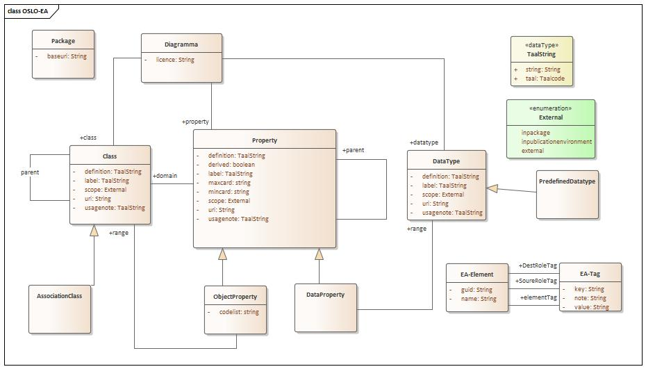
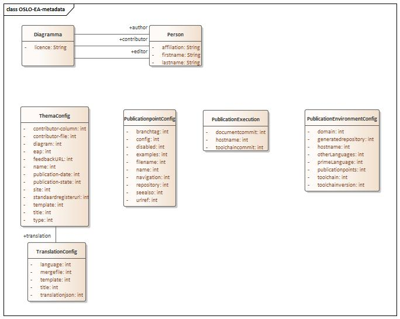

# OSLO Toolchain

The Toolchain is a software environment where UML class diagrams are converted to various specifications. This repository contains multiple packages that together are called the OSLO Toolchain.

## Domain model of the OSLO Toolchain

The Toolchain converts the UML class diagram to an intermediary file in JSON-LD format. The data model of that intermediary file is described in the images below. By converting your data models to an intermediary file that complies with the data model below, it is possible to generate the various specifications.

 
